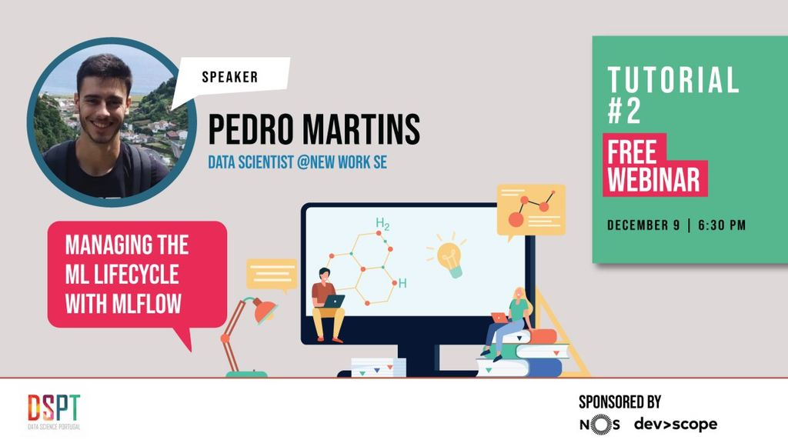

# DSPT - Meetup/Tutorial #2



* Meetup info: https://www.youtube.com/watch?v=qZIEXh4v-5w
* YouTube: https://www.youtube.com/watch?v=qZIEXh4v-5w
* https://www.datascienceportugal.com

---

# Managing the ML lifecycle with Mlflow

In this workshop, we will explore the functionalities of Mlflow as a platform for managing the lifecycle of machine learning experiments and models.

We will look into how it can help us record and query machine learning experiments metadata in several well-known frameworks, as well how we can store and manage models through a central repository. General machine learning, Python and Docker knowledge will help follow the tutorial.

Goal
----

Have a basic understanding of the four main components of Mlflow:
- Tracking
- Projects
- Models
- Registry

Prerequisites
--------

Basic Python and machine learning knowledge, and docker and docker-compose installed.


Setup
-----

**It is highly important to set up the docker environment before the webinar**, since it takes a while to install all the dependencies.

The provided `docker-compose.yml` will set up 4 containers:
- A PostegreSQL database;
- A minio container, emulating an object-store;
- A Mlflow server;
- A ML workspace, that contains online versions of Jupyter and VSCode.

To get everything set up, simply run inside this folder:

```bash
docker-compose up -d
```

It takes some minutes to get all the containers ready. After, you can access:

- Jupyter via `http://127.0.0.1:8080`
- Mlflow via `http://127.0.0.1:5000` 

Resources and references
-----------------------

- [Mlflow](https://mlflow.org)
- [ML workspace](https://github.com/ml-tooling/ml-workspace)
- [mlflow-docker](https://github.com/Toumash/mlflow-docker)
- [Ambiata - MLOps tools](https://www.ambiata.com/blog/2020-12-07-mlops-tools/)
- [The Cheesy analogy of Mlflow and Kubeflow](https://servian.dev/the-cheesy-analogy-of-mlflow-and-kubeflow-715a45580fbe)
- [Machine learning tools comparison](https://www.netguru.com/blog/machine-learning-tools-comparison)
- [Decision Trees - scikit-learn](https://scikit-learn.org/stable/modules/tree.html#classification)
- [Basic classification: Classify images of clothing](https://www.tensorflow.org/tutorials/keras/classification)
- [HyperParameter Tuning — Hyperopt Bayesian Optimization](https://medium.com/analytics-vidhya/hyperparameter-tuning-hyperopt-bayesian-optimization-for-xgboost-and-neural-network-8aedf278a1c9)
