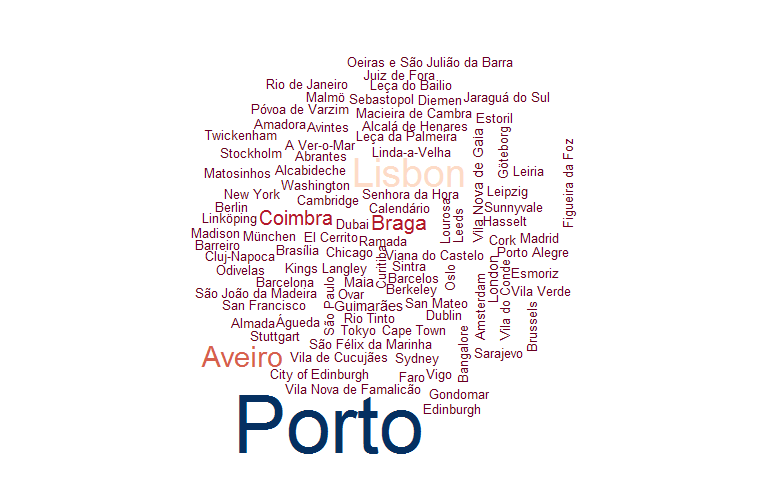
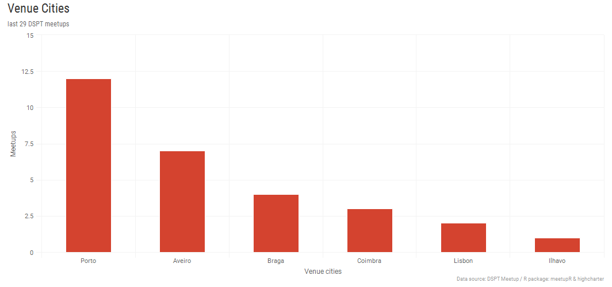
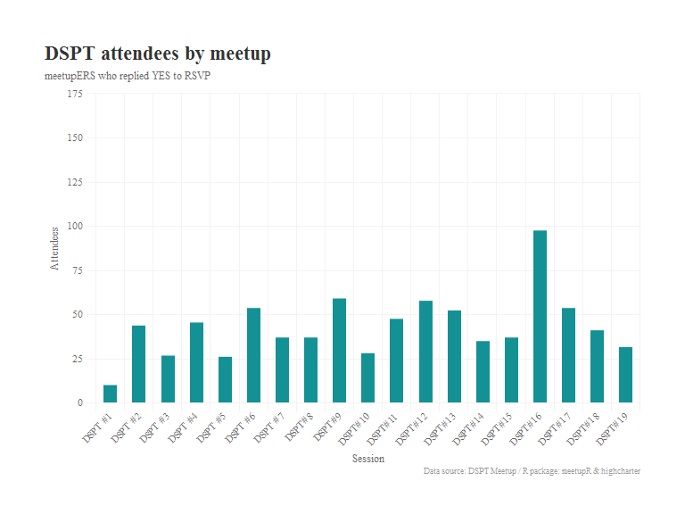

DSPT Github Repository
----------------------

Hello,

Here is the repository where all the presentations from our past meetups are kept.

If you want to know more about our community, check out our [meetup page](https://www.meetup.com/datascienceportugal) and join us!

You can also check here below some interesting information about our community, which is continously growing since the first session on 20th of September 2016.

### DSPT Members' demography

There are currently **820** active members/followers in our meetup page. They are from the **80** cities around the world shown here after.

### We began in the north of Portugal, but we're expanding to other cities too.

By **2017-12-05** we've already performed **19** meetups. Sessions have been held in several cities in Portugal, most of them in **Porto** and **Aveiro**.

### Which have been the most captivating sessions?

The session where most people have replied **YES** to the *RSVP* request was **DSPT\#16** - **Data Science Inception: breaking stuff, one window at a time**, held in **Lisbon** on **2017-11-07**.

